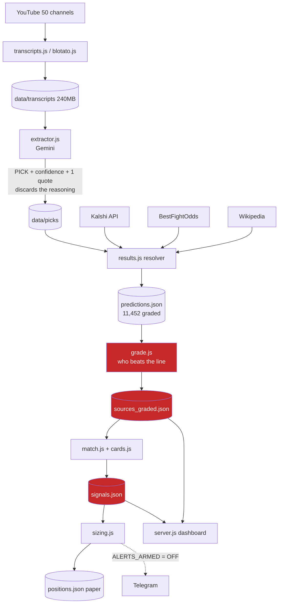
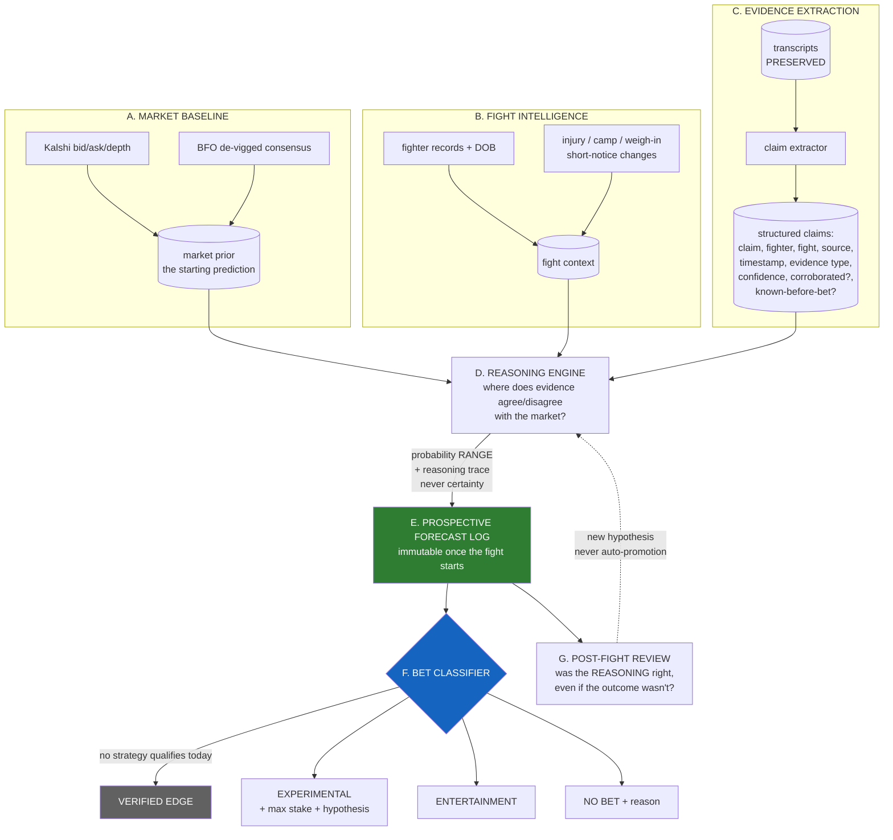

# Sharp Signals — V1 → V2 Refresh Audit

**Status:** audit only. Nothing has been deleted, disabled, or rewritten.
**V1 frozen at:** git tag `v1-archive` → `d3fff9d`, pushed to origin.
**Date:** 2026-07-16

---

## 0. The one thing to read first

**The freeze does not protect your two most expensive caches.**

| Asset | Files | Size | In `v1-archive` tag? |
|---|---|---|---|
| `data/transcripts/` | 6,999 | 240 MB | ✅ yes |
| `data/picks/` | 6,863 | 28 MB | ✅ yes |
| **`data/wiki/`** (fighter DB, DOBs, records) | **14,112** | **325 MB** | ❌ **NO — gitignored** |
| **`data/bfo/`** (odds DB, closing lines) | **1,261** | **46 MB** | ❌ **NO — gitignored** |

They were gitignored as "local, re-fetchable" — true, but re-fetching them took **~8 hours** of throttled scraping, and they are the entire basis of the fighter and odds databases. **They exist on exactly one disk.** Resolving this is Migration Step 1.

---

## 1. Inventory

### 1a. Datasets

| Item | Purpose | Inputs | Outputs | Used? | Validated? | Maint. | Data-quality concerns |
|---|---|---|---|---|---|---|---|
| `data/transcripts/` (6,999 / 240MB) | Raw YouTube transcripts, full text | Blotato/YouTube | text | ✅ | n/a (raw) | low | Auto-caption garbling ("Turkal Tokkos"); some 7-byte empties |
| `data/picks/` (6,863 / 28MB) | Extracted picks per video, fingerprinted | transcripts + Gemini | JSON picks | ✅ | partial | low | **624 exact dupes**; **137 both-sides extraction errors** |
| `data/wiki/` (14,112 / 325MB) | Fighter records + DOBs | Wikipedia API | wikitext | ✅ | 8/8 vs Kalshi | low | **Not archived**; 91 fighters lack DOB |
| `data/bfo/` (1,261 / 46MB) | Odds pages, open+close moneylines | BestFightOdds | HTML | ✅ | 14/14 vs Kalshi | low | **Not archived**; live pages must never be cache-read |
| `data/predictions.json` (11,452) | Graded pick corpus | resolver | graded rows | ✅ | ✅ (audited) | med | Was 9.1% hindsight — **purged**; 26 rows lack fight date |
| `data/sources_graded.json` (50) | Per-source track records | grade.js | stats | ✅ | ✅ | low | Measures a **dead thesis** |
| `data/signals.json` (153) | Live signals | pipeline | signals | ✅ | ✅ | low | 0 bettable; built on the dead framework |
| `data/pick-ledger.json` (635KB) | Waiting/live/settled watch list | pipeline | ledger | ✅ | ✅ (12 tests) | med | Sound, but tied to pick-following |
| `data/positions.json` (2.1KB) | Paper positions | pipeline | positions | ✅ | ✅ (19 tests) | low | Nearly empty — 0 signals qualify |
| `data/listing-watch.json` (24KB) | Birth-price experiment | Kalshi + BFO live | samples | ✅ | n/a (open) | low | 22 markets, all pre-existing so far |
| `data/raw_posts.json` (3,298) | Raw social posts | sources.js | posts | ⚠️ | n/a (raw) | low | Raw asset; provenance unclear |
| `data/channels.json` | Handle → channelId cache | YouTube | JSON | ✅ | ✅ | low | none |
| `data/*.BACKUP.json` (2) | Stale snapshots | — | — | ❌ | ❌ | none | **Superseded by the tag** |
| `data/backups/` (13MB) | My purge snapshots | — | — | ❌ | n/a | none | Superseded by the tag |

### 1b. Scrapers & data access

| Item | Purpose | Used? | Validated? | Concerns |
|---|---|---|---|---|
| `lib/youtube.js` | Channel → recent uploads | ✅ | ✅ | Quota-efficient (1 unit/call, not 100) |
| `lib/transcripts.js` | Transcript fetch | ✅ | ✅ | Public InnerTube constant only |
| `lib/blotato.js` | Transcript provider | ✅ | ✅ | **YouTube transcripts ONLY — hard boundary** |
| `lib/odds-history.js` | BFO scrape, de-vig, closing + live line | ✅ | ✅ 14/14 | `fetchCached` is fatal for live; `fetchLive` added |
| `lib/ufc-results.js` | Wikipedia results + records | ✅ | ✅ 8/8 | Hindsight guard **now strict** |
| `lib/kalshi.js` | Kalshi markets/candles | ✅ | ✅ | `close_time` is a placeholder on OPEN markets |
| `lib/sources.js` | Social-pull adapters | ✅ | partial | Multi-platform; only YouTube active |
| `lib/history.js` | Twitter harvest (twitterapi.io) | ❓ | ❌ | Appears unused; grep hits were `odds-history` collisions |
| `lib/claude.js` | Claude-based extractor | ❌ | ❌ | **Dead code** — nothing requires it |

### 1c. Models, logic, and betting

| Item | Purpose | Used? | Validated? | Concerns |
|---|---|---|---|---|
| `lib/grade.js` | Beat-the-line scoring, shrinkage, LCB, OOS survival, multiplicity | ✅ | ✅ | Statistics are excellent; **the premise is dead** |
| `lib/sizing.js` | Fractional Kelly on the lower bound | ✅ | ✅ | Sound. Never sizes off the mean |
| `lib/match.js` | Pick → market matching | ✅ | ✅ | Wrong-side matching verified clean (3/2613 = garbled captions) |
| `lib/names.js` | Name matching | ✅ | ✅ | Accent handling is correct (my audit script's wasn't) |
| `lib/cards.js` | Filler-fight filter | ✅ | ✅ | Good |
| `lib/results.js` | Resolver (Kalshi → BFO fallback) | ✅ | ✅ (post-fix) | Memo bug caused the hindsight leak — fixed |
| `lib/pick-ledger.js` | Watch-list state machine | ✅ | ✅ 12 tests | Sound but pick-centric |
| `lib/positions.js` | Paper trade ledger | ✅ | ✅ 19 tests | **This is the seed of the V2 forecast log** |
| `lib/alert-ledger.js` | Alert dedupe | ✅ | ✅ | Fine |
| `lib/notify.js` | Telegram | ✅ | ✅ | Fine |
| `lib/store.js`, `lib/env.js`, `lib/mock.js` | Plumbing, self-test | ✅ | ✅ | Fine |
| `lib/extractor.js` | Transcript → **picks** + confidence + one quote | ✅ | ✅ (traps) | **Throws away 99.9% of the transcript.** The core V2 rebuild |
| `pipeline.js` bet/alert block | Sizing + paper + alerts | ✅ | ✅ | **ALERTS_ARMED currently OFF. Must stay off.** |

### 1d. Entrypoints (22 — the clutter)

| Script | Purpose | Referenced by |
|---|---|---|
| `pipeline.js` | Main: listen→extract→grade→match→signal | 3 (workflows) |
| `backfill.js` | Historical grading | 3 (workflows) |
| `listing-watch.js` | Birth-price experiment | 1 (workflow) |
| `server.js` | Dashboard | 0 (manual/shortcut) |
| `holdout.js` | **Out-of-sample validation** | 0 |
| `prune.js` | Which sources are worth scanning | 0 |
| `card.js`, `probe.js` | Kalshi views/API explorer | 0 |
| `chats.js`, `ping.js` | Telegram utilities | 0 |
| `regrade.js`, `regrade-close.js`, `regrade-close2.js` | One-off re-grades | 0–1 |
| `diag-line.js`, `diag-linebias.js`, `diag-noline.js` | One-off debugging | 0 |
| `finish-backfill.js`, `scope-historical.js` | One-off backfill helpers | 0 |
| `compare-sports.js` | UFC vs boxing | 0 |
| `boxing.js`, `worldcup.js`, `domains.js` | **Other sports** — out of scope | 0 |

### 1e. Scheduled jobs

| Workflow | Cadence | Runs | Keep? |
|---|---|---|---|
| `pipeline.yml` | hourly | `pipeline.js` | REBUILD — scans for picks; V2 wants evidence |
| `watch.yml` | every 15 min | `pipeline.js --watch` | REBUILD |
| `listing-watch.yml` | every 30 min | `listing-watch.js` | **KEEP** — the only open experiment |
| `backfill.yml` | weekly (Mon) | `backfill.js` | **ARCHIVE** — re-grades a dead corpus weekly; pure cost |

### 1f. Hypotheses tested (the real experiment record)

| # | Hypothesis | Evidence | Verdict |
|---|---|---|---|
| 1 | Our 50 channels beat the closing line | 11,452 picks, 2 yrs | **REJECTED** — −0.4% avg, 0/50 survive OOS |
| 2 | Kalshi lags the sharp book | 20 live markets | **REJECTED** — mean \|gap\| 1.15%, two-sided, 19/20 negative after fees |
| 3 | Two-sided arb on thin books | same 20 | **REJECTED** — every fight's asks sum ≥100¢ |
| 4 | Sources move the line (CLV) | 2,013 picks, mid→mid | **REJECTED** — baseline −1.34 pts, 0/31 beat it |
| 5 | Conviction / "hidden confidence" | 7,324 opinions | **REJECTED** — +52% was 100% hindsight; clean data −42% |
| 6 | Youth residual vs market | 1,474 fresh fights, 525 clusters | **REJECTED** — effect shrank 7×; all 3 CIs span zero |
| 7 | Birth-price lag at listing | running | **OPEN** — verdict needs convergence data |

---

## 2. Classification

### KEEP — reliable infrastructure / raw data for V2
`data/transcripts/` · `data/picks/` · `data/wiki/` · `data/bfo/` · `data/raw_posts.json` · `data/channels.json` · `data/listing-watch.json` · `data/positions.json` · `sources.json` (the curated 50-channel roster) · `.env` · `lib/youtube.js` · `lib/transcripts.js` · `lib/blotato.js` · `lib/odds-history.js` · `lib/ufc-results.js` · `lib/kalshi.js` · `lib/names.js` · `lib/match.js` · `lib/cards.js` · `lib/sizing.js` · `lib/positions.js` · `lib/notify.js` · `lib/alert-ledger.js` · `lib/store.js` · `lib/env.js` · `lib/mock.js` · `lib/sources.js` · `holdout.js` · `listing-watch.js` + its workflow · all 8 tests

### ARCHIVE — completed experiments; must not influence V2 predictions
`data/predictions.json` · `data/sources_graded.json` · `data/signals.json` · `data/backups/` · `regrade*.js` (3) · `diag-*.js` (3) · `finish-backfill.js` · `scope-historical.js` · `compare-sports.js` · `boxing.js` · `worldcup.js` · `domains.js` · `backfill.yml` · all scratchpad studies (CLV, conviction, youth, audit) · `HANDOFF.md`

### REBUILD — good concept, wrong implementation
| Item | Why |
|---|---|
| `lib/extractor.js` | Extracts **conclusions**; V2 needs **structured claims**. The single most valuable rebuild |
| `lib/grade.js` | Keep the statistics (shrinkage, LCB, OOS survival, Šidák); drop "trust a source" |
| `lib/results.js` | Resolver is sound post-fix but is welded to pick-grading |
| `lib/pick-ledger.js` | Right idea (state machine), wrong unit (pick, not fight/claim) |
| `server.js` + `public/index.html` | Shows history; V2 must answer "what about the next fight?" |
| `pipeline.js` | Does five jobs; V2 splits them into modules |
| `config.json` | Params for a dead thesis |
| `pipeline.yml`, `watch.yml` | Cadence is fine; payload is wrong |

### REMOVE — dead, duplicate, or unvalidatable
| Item | Why |
|---|---|
| `lib/claude.js` | Dead code — nothing requires it |
| `lib/history.js` | Twitter harvest, appears unused; **verify before removing** |
| `data/predictions.BACKUP.json`, `data/sources_graded.BACKUP.json` | Superseded by the tag |
| `chats.js`, `ping.js`, `probe.js`, `card.js` | Utilities; recover from the tag if ever needed |
| `pipeline.js` auto-bet/alert block | Per §5 — no automatic execution during the refresh |

> **No raw source data is classified REMOVE.**

---

## 3. V1 architecture map

**The red path is the dead thesis.** Everything downstream of "who beats the line" rests on a premise disproven by 11,452 picks. Note what the map makes obvious: **the transcript's reasoning is destroyed at the `extractor.js` step and never recovered.**

---

## 4. Proposed V2 architecture

**Structural guarantees:**
- The forecast log is written **before** the fight and immutable after — hindsight becomes *physically impossible*, not merely forbidden. Both bugs that fooled us (the memo leak, the 2-day grace) would have been impossible under this design.
- **VERIFIED EDGE is unreachable today.** It is greyed out by construction: nothing may enter it without a prospective record.
- The reasoning engine emits a **range + trace**, never a point estimate dressed as certainty.

---

## 5. Migration plan

| Phase | Action | Risk | Reversible? |
|---|---|---|---|
| **0** | ✅ Freeze `v1-archive` tag (done, pushed) | none | n/a |
| **1** | **Back up `data/wiki` + `data/bfo` off this disk** (371MB) — they are in no archive | **HIGH if skipped** | n/a |
| **2** | Disable `backfill.yml` (weekly re-grade of a dead corpus) | none | yes |
| **3** | Confirm `ALERTS_ARMED` off; delete the auto-bet block from the live path | none | yes (tag) |
| **4** | Move ARCHIVE scripts to `archive/` — moved, not deleted | low | yes |
| **5** | Build **C. Evidence Extraction** beside the old extractor. Both run; compare | low | yes |
| **6** | Build **E. Forecast Log** + **F. Bet Classifier**. Log for real, bet nothing | low | yes |
| **7** | Rebuild the dashboard against the forecast log | low | yes |
| **8** | Retire `grade.js`'s source-trust path once the log has ≥1 full card | low | yes |
| **9** | Remove REMOVE-class code (recoverable from the tag forever) | low | yes |

**Sequencing rule:** V2 modules are built *beside* V1, never on top. Nothing is deleted until its replacement has run on a real card.

---

## 6. Components to be disabled

| Component | Action | Why |
|---|---|---|
| Auto-bet / auto-alert block in `pipeline.js` | **DISABLE** | §5 — no automatic execution during the refresh |
| `backfill.yml` weekly re-grade | **DISABLE** | Weekly cost re-grading a rejected thesis |
| `sources_graded.json` → signal generation | **DISABLE** | The dead premise |
| Dashboard "trusted source" badges | **DISABLE** | Actively misleading — in-sample only |
| Any promotion to VERIFIED EDGE | **DISABLE** | Nothing qualifies; must be structurally unreachable |

**Not disabled:** `listing-watch.yml` (the one open experiment, costs ~nothing) and the transcript scan (feeds the research library).

---

## 7. Raw assets preserved

| Asset | Size | Where | Value |
|---|---|---|---|
| 6,999 transcripts | 240 MB | tag + origin | **The crown jewel.** The only asset never mined |
| 14,112 Wikipedia fighter pages | 325 MB | **local only ⚠️** | Fighter DB: records, DOBs, results |
| 1,261 BFO pages | 46 MB | **local only ⚠️** | Odds DB: open + closing lines, ~5,230 fights |
| 6,863 pick extractions | 28 MB | tag + origin | Cache; avoids re-paying Gemini |
| 3,298 raw social posts | 1.1 MB | tag + origin | Raw, unmined |
| 50-channel curated roster | — | tag + origin | 3 discovery passes + a quality prune |
| 11,452 graded picks | 5.6 MB | tag + origin | **Hypothesis generation only.** Never validation |

---

## 8. Risks

| # | Risk | Severity | Mitigation |
|---|---|---|---|
| 1 | **`wiki`/`bfo` caches exist on one disk and are in no archive** | **HIGH** | Migration Step 1. Re-fetchable, but ~8 hrs of throttled scraping |
| 2 | Re-extracting reasoning from 3,578 videos costs real Gemini spend (~39M tokens) | MED | Scope to the clean set first; the transcript cache means we never re-fetch |
| 3 | The V2 evidence layer becomes a new way to fool ourselves | **HIGH** | Prospective log + immutability + no VERIFIED EDGE path |
| 4 | Deleting something needed | LOW | Everything recoverable from `v1-archive` forever |
| 5 | Historical data leaks back into validation | **HIGH** | §6 separation must be **structural** (separate stores), not a policy someone remembers |
| 6 | Cloud bots write `data/` mid-migration and cause conflicts | MED | Same `sharp-signals` concurrency group; disable `backfill.yml` early |
| 7 | Refresh becomes a rewrite that never ships | MED | Build beside V1; each phase independently useful |
| 8 | The forward log takes months to say anything | **CERTAIN** | Accept it. That's the entire point of the refresh |

---

## 9. Definition of a successful refresh

**A successful refresh is NOT "we found an edge."** Five hypotheses died on real evidence; a sixth is open. The market may simply be efficient, and the refresh cannot change that.

Success is:

1. **V1 is recoverable forever** — tag + the two caches backed up off-disk.
2. **The transcripts are reframed** from a pick-history into an MMA research library, with **reasoning separated from picks**.
3. **No automatic betting.** Every proposal is labeled, stake-capped, and names the hypothesis it tests. **No path to VERIFIED EDGE exists.**
4. **A prospective forecast log exists and is immutable after fight start.** Hindsight is structurally impossible, not merely against the rules.
5. **Historical and prospective data are physically separated.** History proposes; only the future disposes.
6. **The dashboard answers one question** — *what should I do about the next fight, and why not?* — and nothing else.
7. **Clutter is gone:** 22 entrypoints → ~5.
8. **The honest test:** when the next beautiful, monotonic, obviously-true pattern appears — and it will, exactly like the +52% did — **V2 should make it harder to believe, not easier.** If the refresh only makes the system prettier, it failed.

---

*Audit produced before any modification. V1 frozen at `v1-archive` → `d3fff9d`.*
